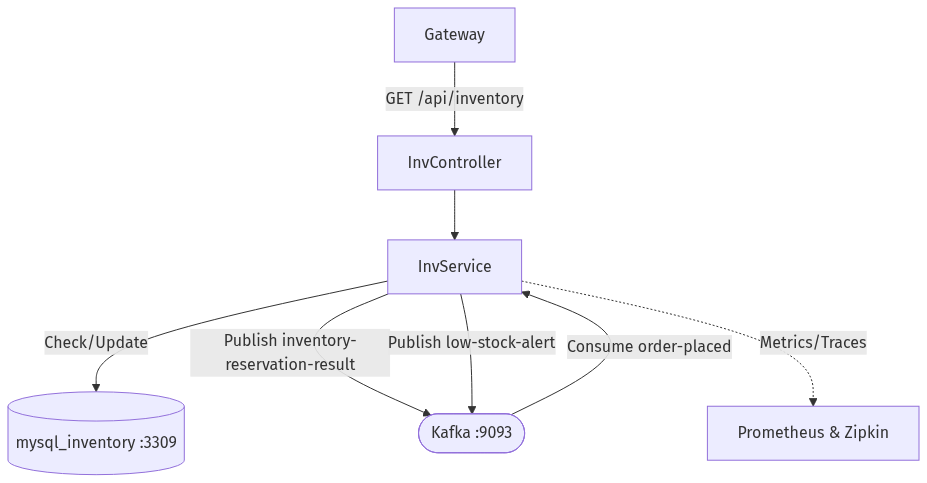

<div align="center">
  <h1>📦 Bitlord's Computer Parts - Inventory Service</h1>
  <p>Manages product catalogs, stock tracking, and automated inventory reservations.</p>
</div>

## 📖 Overview
The **Inventory Service** maintains the system of record for all computer parts in the store. It is responsible for serving product data to the frontend, synchronously accepting administrative updates, and asynchronously managing stock reservations in response to incoming orders.

[⬅️ Back to Main Repository](https://github.com/yourusername/bitlord-computer-parts)

### 🔷 System Flow Diagram



## 🛠️ Tech Stack
- **Language**: Java 17
- **Framework**: Spring Boot 3.2
- **Data Access**: Spring Data JPA / Hibernate
- **Database**: MySQL 8.0
- **Messaging**: Apache Kafka
- **Service Discovery**: Netflix Eureka Client
- **Observability**: Prometheus, Micrometer, Zipkin

## 🔌 API Endpoints
Base path routing via API Gateway: `/api/inventory`
| Method | Endpoint | Description |
|---|---|---|
| `GET` | `/` | List all available products/inventory items |
| `GET` | `/{sku}` | Get inventory details for a specific SKU |
| `POST` | `/` | Add a new product to the inventory (Admin) |
| `PATCH` | `/{sku}/adjust` | Manually adjust stock levels for a SKU (Admin) |

## 📡 Event-Driven Communication (Kafka)
The Inventory Service actively participates in the Order Placement Saga pattern.

**Topics Consumed:**
- `order-placed`: Consumed to extract the items and quantities requested by a customer. The service attempts to reserve this stock.

**Topics Published:**
- `inventory-reservation-result`: Published to inform the Order Service whether the requested stock reservation was successful (triggering order confirmation) or failed (triggering order failure).
- `low-stock-alert`: Published automatically if a successful reservation drops a product's stock count below its predefined warning threshold.

## 🗄️ Database
- **Engine**: MySQL
- **Database Name**: `bitlord_inventory`
- **Port**: `3309` (when running via Docker Compose)

## 🚀 How to Run Locally

### Prerequisites
- JDK 17
- Maven
- Infrastructure dependencies running (Kafka, Zookeeper, MySQL, Eureka Server) via the main repository's `docker-compose.yml`.

### Steps
1. Navigate to the `inventory-service` directory.
2. Build the project:
   ```bash
   mvn clean install -DskipTests
   ```
3. Run the application:
   ```bash
   mvn spring-boot:run
   ```
4. The service will start on port `8082` and register itself with the Eureka Server.
